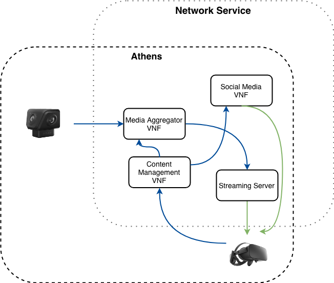
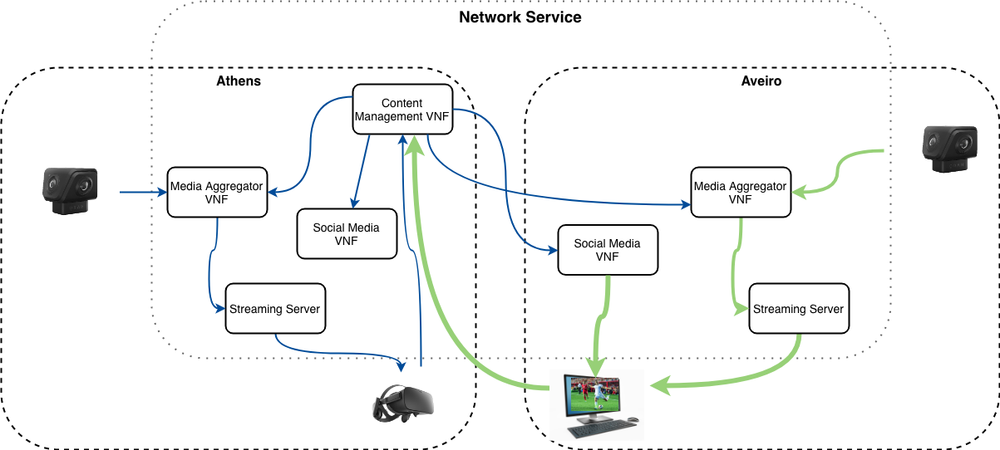

# tng-media-pilot
5GTANGO Immersive Media pilot repository

The immersive media pilot aims to elaborate on the usability of 5GTANGO platform for media streaming applications for state-of-the-art technologies such as Virtual reality HMDs.
Currently, the pilot focuses on development of components that use the 5GTANGO 
platform for streaming of single 360° camera footage with more secondary streams 
over the network with social media integration and automatic QoS detection to provide 
a seamless experience to the end user on a VR or non-VR device.

## Folder structure

| Folder | Comment |
| --- | --- |
| `emulators` | Source and Dockerfiles of the CPE/CCE |
| `images` | images |
| `mediapilot-service` | Service descriptors |
| `video-test`| Service test descriptors |
| `vnfs` | Source, Dockerfiles and other files of the VNFs |

## Use-cases description
#### Single location streaming

This scenario will work with the camera placed at the same location 
as the end user device. The camera can stream a video and the all the
VNFs will be deployed at the same location.Depicts the VNFs that will 
be deployed for the NS to run.

#### Multi location streaming

In this use-case, there would be multiple streams coming from the 
multiple locations to one or many users. Shows the deployment of VNFs 
at various locations for the NS. There would be single Content management 
VNF handling at least 20 users at once with multiple social media VNFs, 
Streaming servers deployed in the network service. The platform should 
be able to scale the VNfs based on the location requirements and the 
number of users. 

#### Streaming with near real-time video analysis

In this use-case, there would be one main 360 stream which can have 
other supporting streams. The novelty of the use case would be the video 
analysis that will take place on the edge of the network in near 
real-time. The analysis will include game information, player statistics, 
highlighting of sports equipment such as balls in table tennis. Shows 
the usage of video analysis VNFs on top of UC1.

## Network Service Components
* Media-Content-Manager: The user (producers and clients) gateway to the service. 
Has an interface to register the other components of the service like 
cameras or streams.
 
* Media-Aggregator: Receives streams from cameras and sends it to the streaming-engine 
or to another aggregator in a different node.
 
* Media-Streaming-Engine: Implements the adaptive streaming functions. Transcodes the RTMP
flow to different qualities (low, medium or source), finally serves the video to the clients. 

* Twitter-VNF: 

* YouTube-VNF:
## Test components
* Content-Producer-Emulator: Simulates the rol of cameras sending RTMP streams to the 
media-aggregator.

* Content-Consumer-Emulator: Simulates the rol of the users playing the video from the
streaming-engine. 

